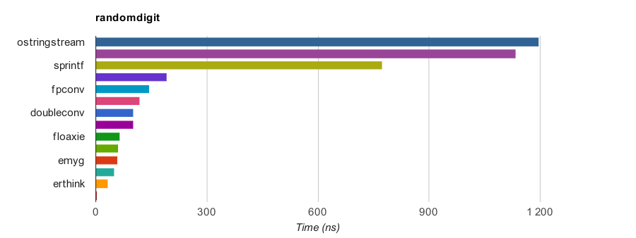
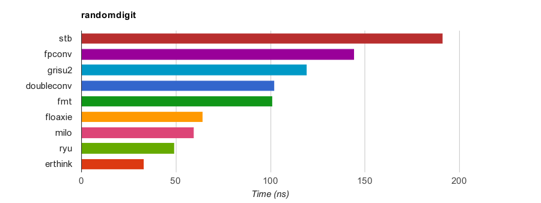
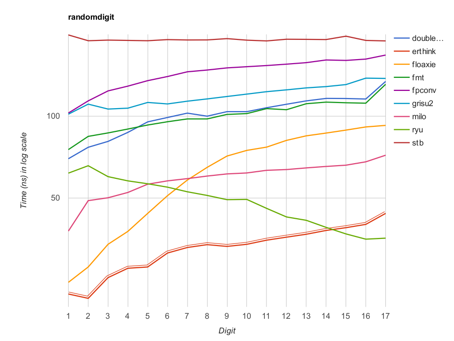

<!-- Required extensions: pymdownx.betterem, pymdownx.tilde, pymdownx.emoji, pymdownx.tasklist, pymdownx.superfences -->

# dtoa Benchmark

Copyright(c) 2019-2020 Leonid Yuriev <leo@yuriev.ru>,
Copyright(c) 2014 Milo Yip <miloyip@gmail.com>

## Preamble

This fork of the benchmark was created to demonstrate the performance superiority of my new `dtoa()` implementation over others.

[Ryū algorithm](https://github.com/ulfjack/ryu) by Ulf Adams known to fastest in much cases, especially for short string representations. However, I would like to draw attention to my own speed-competing but more compact implementation.

Briefly, about this double-to-string implementation:

1. It is fastest Grisu-based, but not exactly the Grisu3 nor Grisu2;

2. Compared to Ryū this implementation significantly less in code size and spends less clock cycles per digit, but may slightly inferior in a whole on a 16-17 digit values.

3. Output string representation _always_ roundtrip convertible to the original value, i.e. `strtod()` for character string result will return the exactly original value.

4. Generated string representation is shortest for more than `99.963%` of
IEEE-754 double values, i.e. one extra digit for less that `0.037%` values.
Moreover, for less than `0.06%` of double values, the last digit differs
from an ideal nearest by `±1`.

5. For now produces only a raw ASCII representation, e.g. `-22250738585072014e-324` without dot and `'\0'` at the end;

Now I would like to get feedback, assess how much this is in demand and collect suggestions for further improvements. For instance, I think that it is reasonable to implement conversion with a specified precision (i.e., with a specified number of digits), but not provide a printf-like interface. For more into see [issue#1](https://github.com/erthink/erthink/issues/1).

Any suggestions are welcome!

## Introduction

This benchmark evaluates the performance of conversion from double precision IEEE-754 floating point (`double`) to ASCII string. The function prototype is:

~~~~~~~~cpp
void dtoa(double value, char* buffer);
~~~~~~~~

The character string result **must** be convertible to the original value **exactly** via some correct implementation of `strtod()`, i.e. roundtrip convertible.

Note that `dtoa()` is *not* a standard function in C and C++.

## Procedure

Firstly the program verifies the correctness of implementations.

Then, **RandomDigit** case for benchmark is carried out:

* Generates 2000 random `double` values, filtered out `+/-inf` and `nan`. Then convert them to limited precision (1 to 17 decimal digits in significand).

* Convert these generated numbers into ASCII.

* Each digit group is run for 10000 times. The minimum time duration is measured for 42 trials.

## Build and Run

1. Obtain [cmake](https://cmake.org/download/)
2. Configure build system by running `cmake .` and build benchmark by running `cmake --build .`
3. On success, run the `dtoa-benchmark` executable is generated at `dtoa-benchmark/` or corresponding subdirectory (e.g `Release` on Windows).
4. The results in CSV format will be written to `dtoa-benchmark/results`.
5. Run GNU `make` in `dtoa-benchmark/results` to generate results in HTML.

## Results

The following are results measured by `RandomDigit` testcase on a PC (Core i7-7820HQ CPU @ 2.90GHz),
where `dtoa()` is compiled by GNU C++ 9.2.1 for x86-64 Linux.
The speedup is based on `sprintf`'s _Sum_ values.

Function      |  Min ns |  RMS ns  |  Max ns |   Sum ns  | Speedup |
:-------------|--------:|---------:|--------:|----------:|--------:|
null          |     1.2 |    1.200 |     1.2 |      20.4 |   N/A   |
erthink       |    21.4 |   33.381 |    43.9 |     558.1 | ×23.5   |
ryu           |    35.3 |   50.011 |    65.7 |     835.4 | ×15.7   |
emyg          |    38.1 |   58.310 |    69.7 |     983.2 | ×13.3   |
milo          |    37.8 |   59.819 |    71.8 |    1007.7 | ×13.0   |
floaxie       |    24.5 |   68.028 |    92.4 |    1089.8 | ×12.0   |
fmt           |    75.3 |  101.532 |   130.8 |    1712.2 | ×7.7    |
doubleconv    |    69.7 |  103.070 |   134.0 |    1731.4 | ×7.6    |
grisu2        |   101.6 |  119.538 |   137.8 |    2024.3 | ×6.5    |
fpconv        |   102.6 |  145.437 |   167.5 |    2454.2 | ×5.3    |
stb           |   188.8 |  191.082 |   198.6 |    3248.1 | ×4.0    |
sprintf       |   700.1 |  772.833 |   827.7 |   13119.8 | ×1.0    |
ostrstream    |  1058.4 | 1133.081 |  1187.4 |   19250.5 | ×0.7    |
ostringstream |  1110.9 | 1196.817 |  1267.8 |   20327.0 | ×0.6    |

#### All implementations

More [clickable charts](https://erthink.github.io/dtoa-benchmark/results/randomdigit.html).

#### Fastest competitors

## Implementations in descending order of speed

Function      | Description
--------------|-----------
[erthink](https://github.com/erthink/erthink/blob/master/erthink_d2a.h) | Leonid Yuriev's Grisu-based C++ implementation.
[ryu](https://github.com/ulfjack/ryu) | Ulf Adams's [Ryū algorithm](https://dl.acm.org/citation.cfm?id=3192369).
[emyg](https://github.com/miloyip/dtoa-benchmark/blob/master/src/emyg/emyg_dtoa.c) | C version of Milo Yip's Grisu2 implementation by Doug Currie.
[milo](https://github.com/miloyip/dtoa-benchmark/blob/master/src/milo/dtoa_milo.h) | Milo Yip's Grisu2 C++ implementation for RapidJSON.
[floaxie](https://github.com/aclex/floaxie) | Alexey Chernov's Grisu2 implementation for .
[fmt](https://github.com/fmtlib/fmt) | Victor Zverovich's Grisu2 implementation for `{fmt}` C++ library.
[doubleconv](https://code.google.com/p/double-conversion/) |  C++ implementation extracted from Google's V8 JavaScript Engine with `EcmaScriptConverter().ToShortest()` (based on Grisu3, fall back to slower bignum algorithm when Grisu3 failed to produce shortest implementation).
[grisu2](http://florian.loitsch.com/publications/bench.tar.gz?attredirects=0) | Florian Loitsch's Grisu2 C implementation [1].
[fpconv](https://github.com/night-shift/fpconv) | Andreas Samoljuk's Grisu2 C implementation.
[stb](https://github.com/nothings/stb)         | Jeff Roberts's & Sean Barrett's snprintf() implementation.
sprintf       | `sprintf()` in C standard library with `"%.17g"` format.
ostringstream | traditional `std::ostringstream` in C++ standard library with `setprecision(17)`.
ostrstream    | traditional `std::ostrstream` in C++ standard library with `setprecision(17)`.
~~[gay](http://www.netlib.org/fp/)~~ | David M. Gay's `dtoa()` C implementation. **Disabled** because of invalid results and/or SIGSEGV.

## FAQ

1. How to add an implementation?

   You may clone an existing implementation file, then modify it and add to `CMakeLists.txt`.
   Re-run `cmake` to re-configure and re-build benchmark.
   Note that it will automatically register to the benchmark by macro `REGISTER_TEST(name)`.

   **Making pull request of new implementations is welcome.**

2. Why not converting `double` to `std::string`?

   It may introduce heap allocation, which is a big overhead. User can easily wrap these low-level functions to return `std::string`, if needed.

3. Why fast `dtoa()` functions is needed?

   They are a very common operations in writing data in text format. The standard way of `sprintf()`, `std::stringstream`, often provides poor performance. The author of this benchmark would optimize the `sprintf` implementation in [RapidJSON](https://github.com/miloyip/rapidjson/).

## References

[1] Loitsch, Florian. ["Printing floating-point numbers quickly and accurately with integers."](http://florian.loitsch.com/publications/dtoa-pldi2010.pdf) ACM Sigplan Notices 45.6 (2010): 233-243.

## Related Benchmarks and Discussions

* [Printing Floating-Point Numbers](http://www.ryanjuckett.com/programming/printing-floating-point-numbers/)
